# 🚀 Noyo - 新一代 AIOT 平台/网关 (开源社区版)

**诺优 Noyo** 取名于“Know you”同音，slogan为：“懂你所需，予你所优”。
这是一款面向未来的 AIOT 平台/网关。秉承“极致轻量、极简扩展、极速连接”的设计理念，Noyo 提供从南向设备接入、边缘计算到北向数据流转的端到端解决方案。

本仓库为 Noyo 的社区开源版，代码基于 **Apache 2.0 许可**完全开源，承诺永久免费商用。

---

## ✨ 核心特性

Noyo 社区版不仅“开箱即用”，更在底层架构上做到了工业级标准，核心亮点包括：

- 🔌 **南向设备零代码接入**:
  - **工业级 Modbus TCP**：原生深度集成，支持复杂点位读写与寄存器映射，工业传感与自动化设备一键上云。
  - **楼宇级 BACnet/IP**：开箱即用，精准定位智能楼宇与暖通空调（HVAC）场景，实现楼宇设备的无缝双向通讯。
- 📦 **物模型驱动 (TSL-Driven)**:
  - 内置标准化物模型（Thing Specification Language）引擎，对设备的属性（Property）、事件（Event）和服务（Service）进行抽象化管理，实现设备“数字孪生”。
- 🌐 **北向生态无缝融合 (Northbound Integration)**:
  - **MQTT API 平台网关**：提供标准的 MQTT 接口，实时推送设备时序数据，极易对接自研 SaaS 应用。
  - **Sagoo 平台直连**：作为接入IOT网关，一键打通 SagooIOT 平台，构建复杂的物联网中台能力。
- 🪶 **极致轻量，一键单机部署 (Zero Dependency)**:
  - 彻底摆脱沉重的环境依赖（如 MySQL/Redis/Kafka）。系统内置轻量级持久化存储（SQLite/TSDB引擎），一个二进制文件即可在树莓派、工控机或云服务器上极速启动。
- 🎨 **现代化可观测大屏 (Modern UI & Observability)**:
  - 采用最新前端技术栈（Vue 3 + Vite）构建。内置**设备拓扑大屏**、**实时数据折线看板**及**插件化管理视图**，数据流转尽在掌握。

---

## 📸 界面预览 (开源版功能一览)

体验直观的设备管理与数据洞察：

| 控制台核心枢纽 | 动态设备拓扑 |
| :---: | :---: |
| 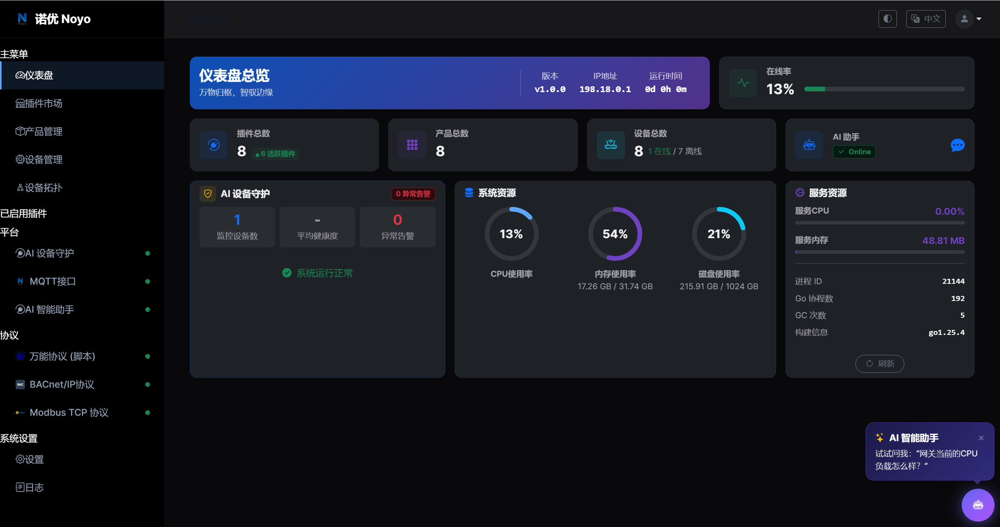 | 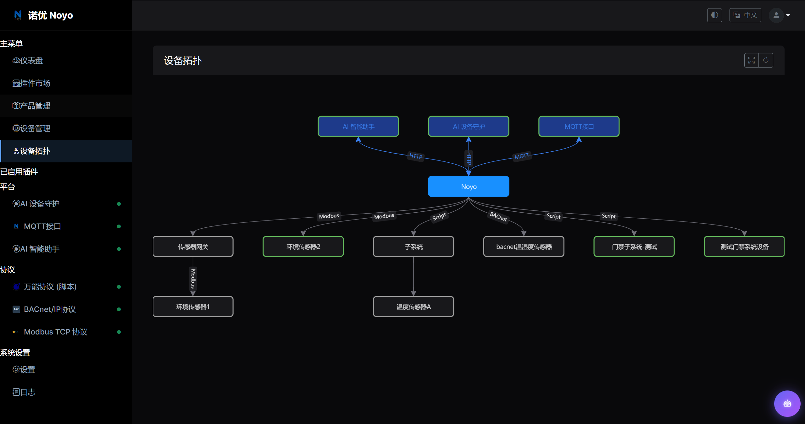 |
| **实时物模型流转数据** | **强大的产品定义与物模型** |
| 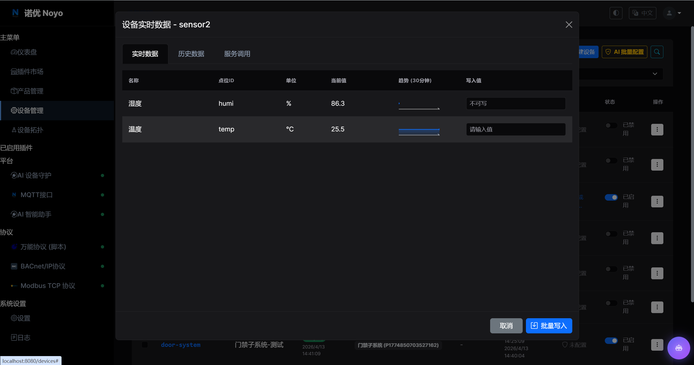 | 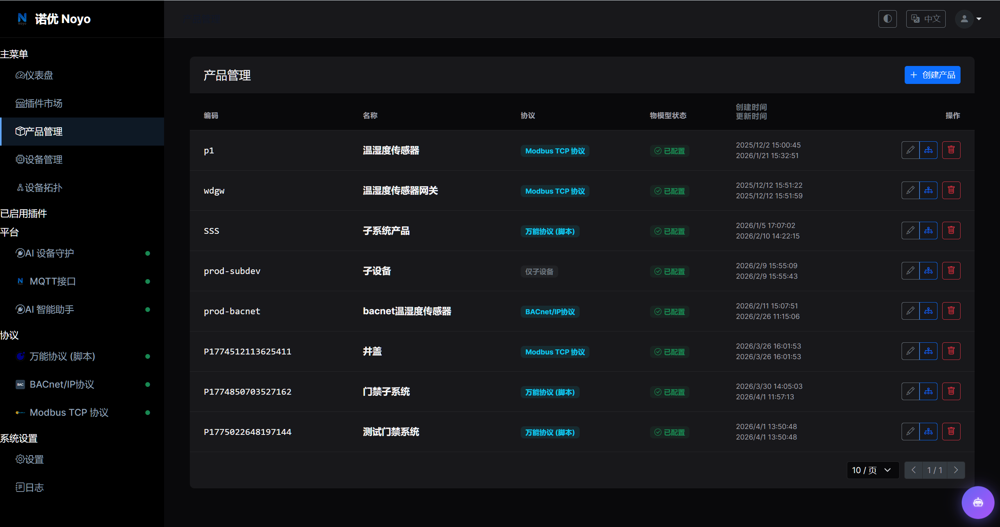 |
| **多协议工业设备接入** | **Modbus TCP 点位可视化配置** |
| 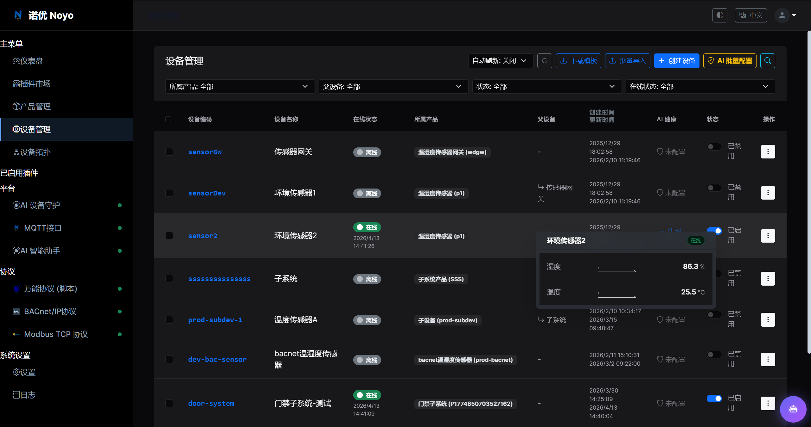 | 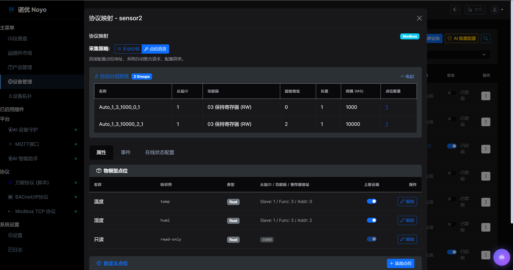 |
| **可扩展的插件应用市场** | **全链路设备操作日志** |
| 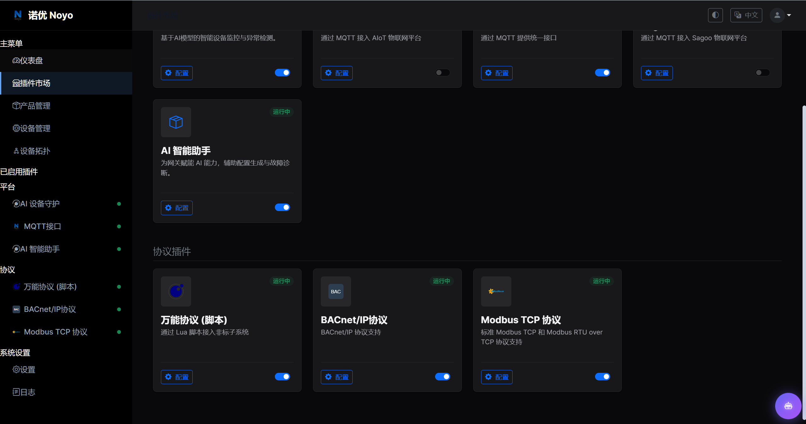 | 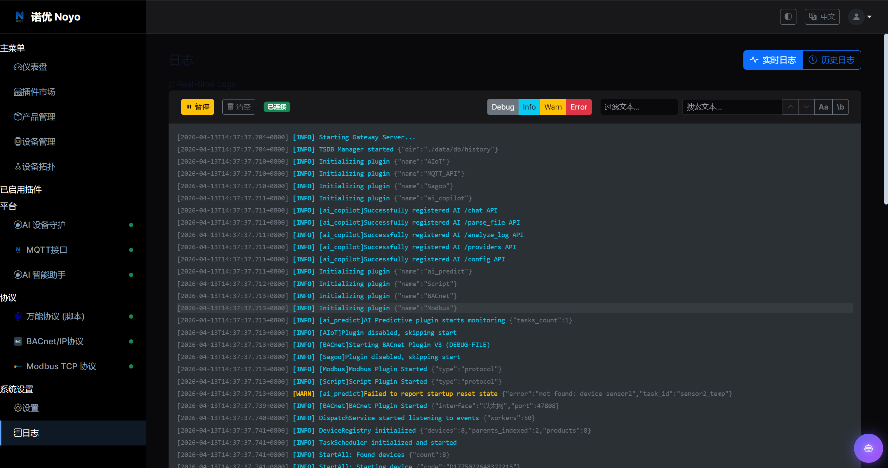 |

---

## 🏗️ 工业级技术架构

Noyo 采用前后端分离与微内核插件化设计，保证了系统的高内聚与低耦合：

- **核心后端引擎 (Backend - Go 1.20+)**: 
  - **高性能并发**：充分利用 Golang 的协程模型，保障海量设备的稳定心跳与高频并发通讯。
  - **微内核插件化 (Plugin System)**：核心总线与协议栈彻底解耦。不论是 `bacnet`、`modbus` 还是 `mqtt`，所有协议均作为动态 Plugin 挂载，二次开发只需实现标准接口，无需侵入核心代码。
- **现代化前端 (Frontend - Vue 3 + Vite)**: 
  - 极致的响应速度与交互体验，基于最新的响应式特性，实现页面无刷新数据推送与双向绑定。

---

## 🚀 极速启动指南

Noyo 支持全平台跨平台编译运行。在开始前，请确保安装 [Go 1.20+](https://go.dev/dl/) 与 [Node.js 18+](https://nodejs.org/en/download/)。

### 1. 构建前端面板

```bash
cd frontend
# 安装前端依赖
npm install
# 构建生产环境静态文件
npm run build
```
*\* 构建产物将输出至 `dist` 目录，启动后端时会自动托管静态路由。*

### 2. 编译并运行核心服务

```bash
cd backend
# 下载并校验 Go 依赖
go mod tidy
# 编译可执行程序（以 Linux/macOS 为例）
go build -o noyo main.go
# 启动平台
./noyo
```
*\* 启动后，引擎将在当前目录自动生成 `data/db` 本地数据文件。打开浏览器访问对应的监听端口（默认为 8989 端口，视配置而定），即可登录 Noyo 控制台。*

---

## 💎 Noyo Pro & Noyo AI Engine (企业级商业闭源版)

面向拥有严苛复杂业务、海量高并发规模以及前沿数智化转型需求的企业，我们倾力打造了 **Noyo Pro 商业专业版**。

升级至专业版，您不仅将获得原厂级 7×24 的架构师支持，更将解锁以下突破性的高阶能力：

### 🌟 商业版独享特性

- 🧠 **Noyo AI Engine (AI 引擎深度赋能)**:
  - **AI Copilot (业务副驾驶)**: 告别繁琐操作，通过自然语言对话完成：查询运行状态、下发设备指令、新增设备、驱动脚本编写、智能日志分析诊断故障原因等。
  - **AI Predict (边缘算法与预测)**: 基于设备时序数据进行智能异常检测（如电机震动异常），实现预测性维护与深度能效分析。
- ⚙️ **万能动态协议引擎 (Script Protocol)**:
  - 面对私有、非标设备？无需停机改代码！内置强大的动态脚本解析器，直接在界面编写 **Lua 脚本**即可实现私有协议的热解析与动态接入。


### 📸 商业版高阶能力预览

让 AIOT 平台真正具备“大脑”与“灵活性”：

| AI 智能助手 (Copilot) | AI 实时设备守护与异常检测 |
| :---: | :---: |
| 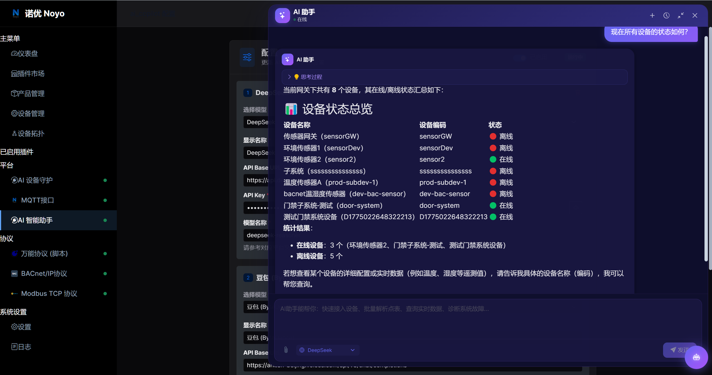 | 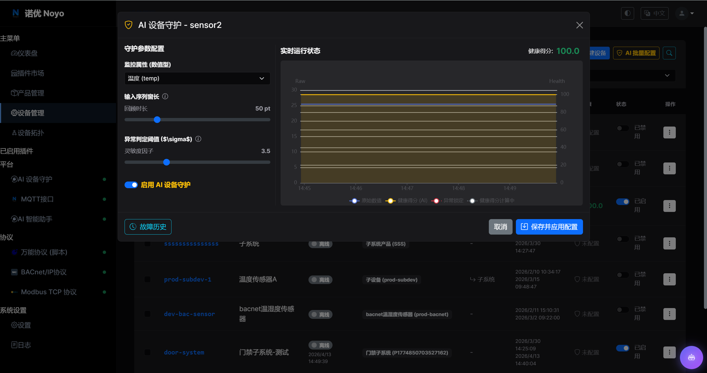 |
| **动态万能协议脚本在线调试与热下发** |  |
| 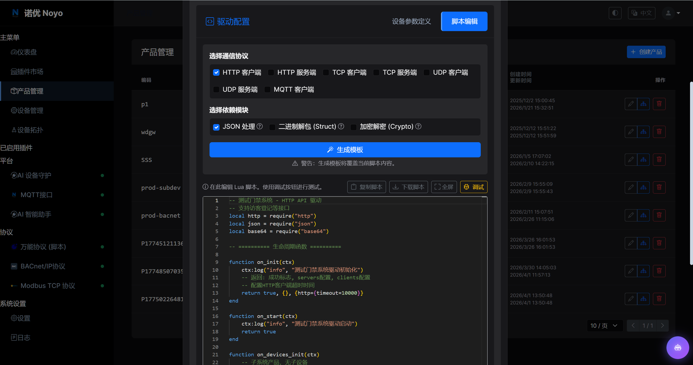 |  |

---

## 🤝 获取企业版支持

**打造下一代的 AIOT 产品，即刻迈向智能化！**
欢迎加入QQ交流群，与我们分享经验、获取技术支持与最新动态。
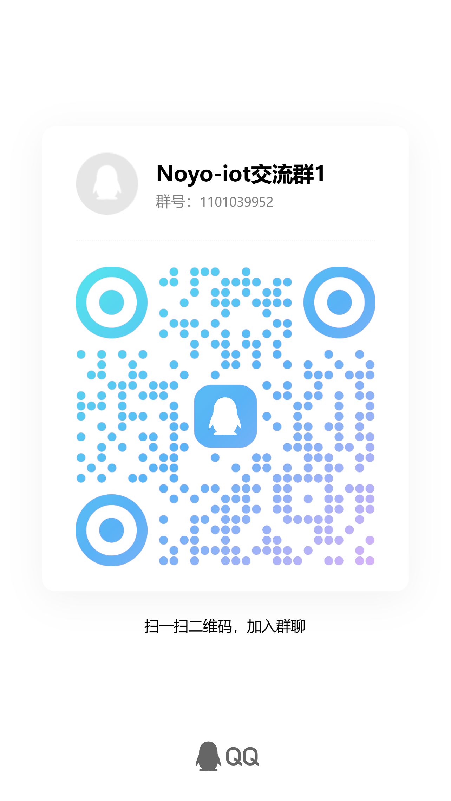
---

**开源许可**: [Apache 2.0 License](./LICENSE) 
*(注：Noyo Pro 及相关 AI Engine 组件受商业条款保护，不在本仓库的开源许可范畴内。)*